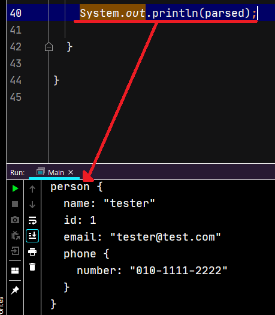

# protobuf3 맛보기

> 참고 https://jeong-pro.tistory.com/190

[커밋 로그](.commits/master)를 보면 진행 내용이 보여 지고요.
`proto` 파일을 작성해서 컴파일(`protoc`)하면 소스가 생성되고, 그걸 바탕으로 파일로 쓰고 파일에서 객체를 읽어보는 내용을 진행했어요.

생성 소스의 `toString()` 이 이렇게 이쁜 JSON 포맷으로 보여주네요.

---
gRPC 도 실습을 해봐야 겠네요.
