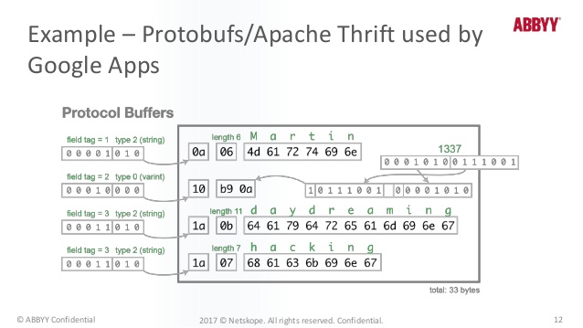

2020년 9월 4일
- APMAX 의 Agent 와 Server 간에 통신 매개체로 적합성 검증

---
# protobuf3
## 개요

데이터 직렬화 모듈.    
  
작동 원리는 그림처럼 맨 앞의 1byte 중 5bit 를 속성의 tag 로.  
3byte 를 data type 으로 활용.

## 장점 vs 단점
---
|장점|단점|
|---|---|
|네트웍 전송량이 적어서 속도 빠름|proto 문법에 대한 학습비용|
|직렬화된 바이트를 이용해서 데이터를 파싱할 필요 없음||
|인터페이스 주도로 개발 가능||

## 활용
### 의존성
현재 기준 최신버전 `3.13.0` (Major 버전 이하 호환성 문제 없음)
```XML
<dependency>
  <groupId>com.google.protobuf</groupId>
  <artifactId>protobuf-java</artifactId>
  <version>3.13.0</version>
</dependency>
```

### 플러그인
1. 시스템 상의 protoc 컴파일러 필요 https://github.com/protocolbuffers/protobuf/releases/  
2. Maven build cycle 중에 `generate-sources` 에서 java 코드 생성
```xml
<plugins>
  <plugin>
    <groupId>org.codehaus.mojo</groupId>
    <artifactId>exec-maven-plugin</artifactId>
    <version>3.0.0</version>
    <executions>
      <execution>
        <phase>generate-sources</phase>
        <goals>
          <goal>exec</goal>
        </goals>
      </execution>
    </executions>
    <configuration>
      <executable>protoc</executable>
      <arguments>
        <argument>--java_out=${basedir}/src/main/protobuf</argument>
        <argument>--proto_path=${basedir}/src/main/protobuf</argument>
        <argument>${basedir}/src/main/protobuf/*.proto</argument>
      </arguments>
    </configuration>
  </plugin>
  <plugin>
     <groupId>org.codehaus.mojo</groupId>
     <artifactId>build-helper-maven-plugin</artifactId>
     <executions>
       <execution>
         <phase>generate-sources</phase>
         <goals>
           <goal>add-source</goal>
         </goals>
         <configuration>
           <sources>
             <source>src/main/protobuf</source>
           </sources>
         </configuration>
       </execution>
     </executions>
   </plugin>
</plugins>
```

### 프로토타입 (인터페이스 대상) 정의
```proto
// src/main/protobuf/MyAddressBook.proto

syntax = "proto3";

package study.taste.protobuf3.proto;

option java_package = "study.taste.protobuf3.proto";
option java_outer_classname = "AddressBookProto";

message AddressBook {
  Person person = 1;
}

message Person {
  string name = 1;
  int32 id = 2;
  string email = 3;
  PhoneNumber phone = 4;
}

enum PhoneType {
  MOBILE = 0;
  HOME = 1;
  WORK = 2;
}

message PhoneNumber {
  string number = 1;
  PhoneType type = 2;
}

```

### 인터페이스 활용 예시
```java
// src/main/java/study/taste/protobuf3/Main.java

package study.taste.protobuf3;

import study.taste.protobuf3.proto.AddressBookProto.PhoneNumber;

import java.io.FileInputStream;
import java.io.FileOutputStream;
import java.io.IOException;

import static study.taste.protobuf3.proto.AddressBookProto.AddressBook;
import static study.taste.protobuf3.proto.AddressBookProto.Person;
import static study.taste.protobuf3.proto.AddressBookProto.PhoneType;

public class Main {
  
  public static final String TXT_FILE = "./tester-address.txt";
  
  public static void main(String[] args) throws IOException {
    final PhoneNumber phoneNumber = PhoneNumber.newBuilder()
        .setType(PhoneType.MOBILE)
        .setNumber("010-1111-2222")
        .build();
    
    final Person person = Person.newBuilder()
        .setEmail("tester@test.com")
        .setId(0x0001)
        .setName("tester")
        .setPhone(phoneNumber)
        .build();
    
    final AddressBook addressBook = AddressBook.newBuilder()
        .setPerson(person)
        .build();
    
    final FileOutputStream out = new FileOutputStream(TXT_FILE);
    addressBook.writeTo(out);
    out.close();
  
    final AddressBook parsed = AddressBook.parseFrom(new FileInputStream(TXT_FILE));
  
    System.out.println(parsed);
  
  }
  
}

```
1. 인터페이스 대상 객체를 Protobuf 가 제공하는 Builder 로 생성
2. 파일로 stream(직렬화 확인) 처리
3. 역직렬화해서 객체 확인 `AddressBook.parseFrom(new FileInputStream(TXT_FILE))`
4. 출력

  
[출력결과]


## 참조
- https://www.slideshare.net/ABBYY_USA/safeguarding-digital-assets-in-a-cloudy-world-with-dlp-strategies-at-abbyysummit17

